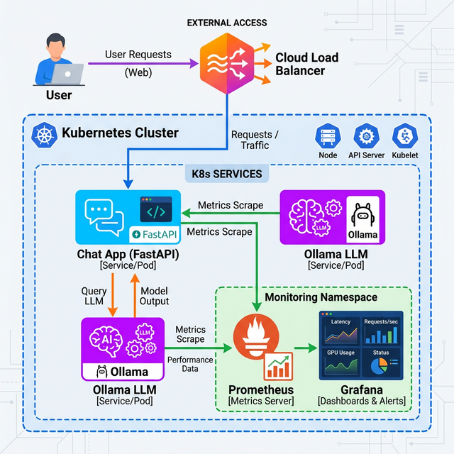
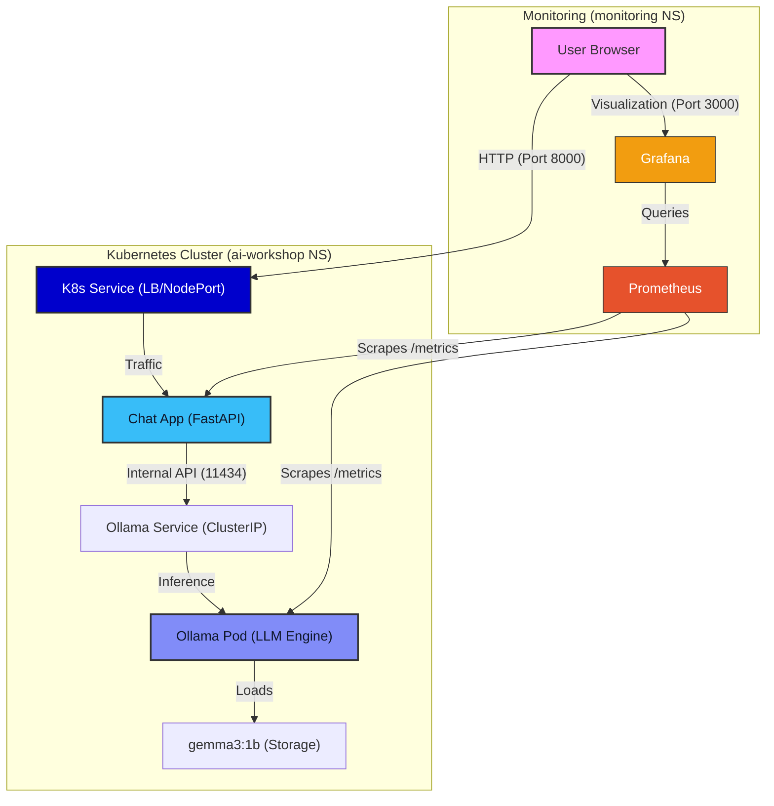

# 🏗️ MMNOG AI Workshop Architecture

This document provides a high-level overview of the workshop's technical architecture.

## System Overview

The application follows a modern cloud-native architecture, leveraging Kubernetes for orchestration, FastAPI for the application layer, and Ollama for local LLM inference.

### Architecture Diagrams
- **[Vibrant 2D Color](./architecture_diagram_2d_color.png)** (Recommended for Slides)
- **[Modern Glassmorphic](./architecture_diagram.png)** (Premium Look)
- **[Black & White Version](./architecture_diagram_bw.png)** (Best for printing)

## Core Components

1.  **Chat Interface (FastAPI)**:
    - Lightweight Python application.
    - Serves the HTML/JS frontend.
    - Acts as a secure proxy to the LLM backend.

2.  **LLM Engine (Ollama)**:
    - Runs as a standalone deployment.
    - Dynamically loads the `gemma3:1b` model.
    - Provides a REST API for text generation.

3.  **Observability (Prometheus & Grafana)**:
    - **Prometheus**: Automatically discovers and pulls metrics from the applications.
    - **Grafana**: Provides pre-configured dashboards for real-time visualization of CPU, Memory, and Request traffic.

4.  **AGB Cloud Infrastructure**:
    - High-performance Kubernetes environment.
    - External access managed via AGB Cloud Port Forwarding or native LoadBalancers.
