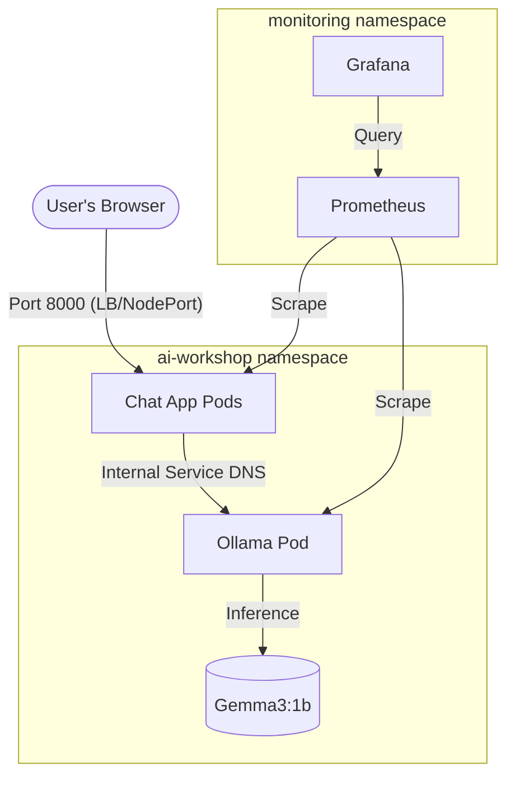

# 📊 MMNOG AI Workshop Introduction Slides

---

## Slide 1: Welcome!
**Title:** Deploying Lite AI Apps on AGB Cloud
**Subtitle:** MMNOG Workshop 2026

*   **Presenter:** [Your Name / Kaung Myat Soe]
*   **Goal:** From zero to a running AI chat app in 2 hours.
*   **Platform:** AGB Cloud (agbc.cloud) - Apache CloudStack Powering AI.

---

## Slide 2: Why AI on Kubernetes?
*   **Scalability:** Auto-scale models using Horizontal Pod Autoscaler (HPA).
*   **Portability:** Use standard Helm charts and manifests anywhere.
*   **Resource Efficiency:** Bin-packing models to maximize CPU/RAM utilization.
*   **Security:** Multi-tenancy and network policies for model isolation.

---

## Slide 3: The Tech Stack
*   **LLM Engine:** [Ollama](https://ollama.com) (Go-based, highly efficient C++ inference).
*   **Backend:** [FastAPI](https://fastapi.tiangolo.com) (High performance, async Python).
*   **Frontend:** Embedded HTML/JS (Zero-dependency, fast loading).
*   **Infrastructure:** Kubernetes on AGB Cloud.
*   **Monitoring:** Prometheus & Grafana stack.

---

## Slide 4: Detailed Architecture

---

## Slide 5: Handling AGB Cloud Networking
*   **Challenge:** Cloud LoadBalancers can be slow to provision in lite environments.
*   **Solution:** **NodePort Access**.
*   **Fixed Ports:** 
    *   `30706` -> Chat App (Public Port 8000)
    *   `31856` -> Grafana (Public Port 3000)
*   **Port Forwarding:** Link Public IPs to these internal ports for instant access.

---

## Slide 6: Model Tuning for Performance
*   **Model:** `gemma3:1b` (815MB) - Ideal for CPU-only environments.
*   **Resource Limits:** 
    *   Ollama: **6Gi memory limit** to prevent OOM errors during high concurrency.
    *   Chat App: **512Mi memory limit** for stability.
*   **Scaling:** HPA triggers at **60% CPU utilization**.

---

## Slide 7: Monitoring & Observability
*   **Metrics:** Tracking CPU cycles, memory pressure, and API response times.
*   **Dashboards:** Real-time visibility into pod scaling events.
*   **Self-Healing:** Readiness/Liveness probes ensure only healthy pods receive traffic.

---

## Slide 8: Workshop Roadmap
1.  **Lab 00:** Tool Check (`kubectl`, `helm`)
2.  **Lab 01:** Connect to **AGB Cloud** Cluster
3.  **Lab 02:** Deploy **Ollama** & Pull LLM
4.  **Lab 03:** Deploy the **Chat UI** (Python Apps)
5.  **Lab 04:** Stress Test & **Auto-Scaling**
6.  **Lab 05:** **Monitoring** with Grafana

---

## Slide 9: Ready? Let's go!
*   **Repo:** https://github.com/kaungmyatsoe/mmnogworkshop.git
*   **Action:** Start with `labs/lab-00-prerequisites.md`
*   **Tip:** Watch your pod status with `kubectl get pods -n ai-workshop -w`!
