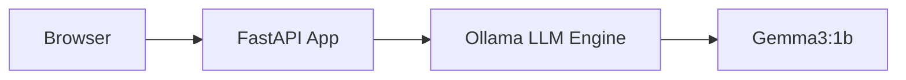

# 📊 MMNOG AI Workshop Introduction Slides

---

## Slide 1: Welcome!
**Title:** Deploying Lite AI Apps on AGB Cloud
**Subtitle:** MMNOG Workshop 2026

*   **Presenter:** [Your Name / Kaung Myat Soe]
*   **Goal:** From zero to a running AI chat app in 2 hours.
*   **Platform:** AGB Cloud (agbc.cloud)

---

## Slide 2: Why AI on Kubernetes?
*   **Scalability:** Auto-scale models as demand grows.
*   **Portability:** Run the same stack on any K8s cluster.
*   **Resource Management:** Efficiently share CPUs/GPUs.
*   **Self-Healing:** Kubernetes restarts models if they crash.

---

## Slide 3: The Architecture

*   **Ollama:** The backend LLM server.
*   **FastAPI:** The friendly web interface (built by us!).

---

## Slide 4: Our AI Model & Stability
**Model:** `gemma3:1b` (~815MB)
*   **Speed:** Optimized for CPU-only inference.
*   **Stability:** Containers tuned with **6Gi RAM limits** to handle heavy load tests without crashing.
*   **Capability:** General-purpose chat, summarization, and coding assistant.

---

## Slide 5: Accessing the App (AGB Cloud)
*   **Public IP:** Provided in your Lab dashboard.
*   **Forwarding Logic:** We use fixed **NodePorts** for reliability.
    *   **Chat App:** Public Port 8000 ↔ Private Port **30706**
    *   **Grafana:** Public Port 3000 ↔ Private Port **31856**

---

## Slide 6: Workshop Roadmap
1.  **Lab 00:** Tool Check (`kubectl`, `docker`)
2.  **Lab 01:** Connect to **AGB Cloud**
3.  **Lab 02:** Run **Ollama** & Download LLM
4.  **Lab 03:** Deploy the **Chat UI**
5.  **Lab 04:** **Auto-Scale** under load
6.  **Lab 05:** **Monitor** performance

---

## Slide 7: Ready? Let's go!
*   **Repo:** https://github.com/kaungmyatsoe/mmnogworkshop.git
*   **Facilitators:** We are here to help!
*   **First Step:** Open `labs/lab-00-prerequisites.md`
