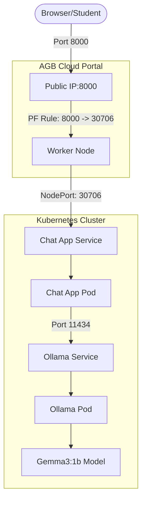

# 📊 MMNOG AI Workshop Introduction Slides

---

## Slide 1: Welcome!
**Title:** Deploying Lite AI Apps on AGB Cloud
**Subtitle:** MMNOG Workshop 2026

*   **Presenter:** [Your Name / Kaung Myat Soe]
*   **Goal:** From zero to a running AI chat app in 2 hours.
*   **Platform:** AGB Cloud (agbc.cloud)

---

## Slide 2: Why AI on Kubernetes?
*   **Scalability:** Auto-scale models as demand grows.
*   **Portability:** Run the same stack on any K8s cluster.
*   **Resource Management:** Efficiently share CPUs/GPUs.
*   **Self-Healing:** Kubernetes restarts models if they crash.

---

---

## Slide 3: The Architecture

---

## Slide 4: Scaling Strategy (Lab 04)
**How do we handle 50 students at once?**
*   **Target:** Maintain application responsiveness.
*   **Trigger:** When average CPU usage exceeds **60%**.
*   **Action:** Horizontal Pod Autoscaler (HPA) adds more replicas.
*   **Minimum:** 3 Pods (always ready).
*   **Maximum:** 8 Pods (to protect cluster resources).

---

## Slide 5: Networking & Access
**The "CloudStack" Way:**
*   **Public IP:** Shared for the whole cluster.
*   **Port Forwarding:** We map a Public Port to a Private **NodePort**.
*   **Hardcoded Ports:**
    *   **Chat App:** NodePort `30706` (Public Port 8000)
    *   **Grafana:** NodePort `31856` (Public Port 3000)
*   **Why?** So every student has consistent, predictable access.

---

## Slide 6: Our AI Engine: Ollama
*   **Self-Hosted:** No API keys (e.g., OpenAI) needed.
*   **Model:** `gemma3:1b` (815MB).
*   **Resource Optimized:** We provide **6Gi RAM** limits to ensure stability during high-load inference.
*   **No GPU? No problem:** We use highly optimized CPU instructions.

---

## Slide 7: Monitoring (Lab 05)
**The Monitoring Stack:**
*   **Prometheus:** Collects metrics from pods (Ollama, Chat App) and nodes.
*   **Grafana:** Visualizes the data in real-time.
*   **Login:** `admin` / `mmnog2026`.
*   **Key Insight:** Watch your Chat App pods scale up as you run the load test!

---

## Slide 8: Future Extensions
*   **GPU Acceleration:** Plug in NVIDIA GPUs for 10x speed.
*   **Persistent Volume (PVC):** Keep models even if pods are deleted.
*   **Ingress & TLS:** Proper domain names and HTTPS.
*   **Vector DB:** Add RAG (Retrieval Augmented Generation) for custom knowledge.

---

## Slide 9: Workshop Roadmap
1.  **Lab 00:** Tool Check (`kubectl`, `docker`)
2.  **Lab 01:** Connect to **AGB Cloud**
3.  **Lab 02:** Run **Ollama** & Download LLM
4.  **Lab 03:** Deploy the **Chat UI**
5.  **Lab 04:** **Auto-Scale** under load
6.  **Lab 05:** **Monitor** performance

---

## Slide 10: Ready? Let's go!
*   **Repo:** https://github.com/kaungmyatsoe/mmnogworkshop.git
*   **Facilitators:** We are here to help!
*   **First Step:** Open `labs/lab-00-prerequisites.md`
