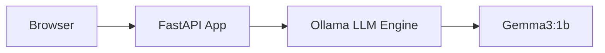

# 📊 MMNOG AI Workshop Introduction Slides

---

## Slide 1: Welcome!
**Title:** Modern Kubernetes: Deploying Cloud-Native AI App

**Subtitle:** MMNOG Workshop 2026

*   **Presenter:** Kaung Myat Soe
*   **Goal:** From zero to a running AI chat app in 2 hours.
*   **Platform:** AGB Cloud (agbc.cloud)

---

## Slide 2: Why AI on Kubernetes?
*   **Scalability:** Auto-scale models as demand grows.
*   **Portability:** Run the same stack on any K8s cluster.
*   **Resource Management:** Efficiently share CPUs/GPUs.
*   **Self-Healing:** Kubernetes restarts models if they crash.

---

## Slide 3: The Architecture

*   **Ollama:** The backend LLM server.
*   **FastAPI:** The friendly web interface (built by us!).

---

## Slide 4: Initializing the Model (CRITICAL)
*   **Default State:** The Ollama pod starts empty.
*   **The Command:** `kubectl exec ... -- ollama pull gemma3:1b`
*   **Common Pitfall:** If you skip this, your chat app will return a **404 Not Found** error.
*   **Why?** Models are ~1GB; we pull them on-demand to save storage.

---

## Slide 4: Our AI Model
**Model:** `gemma3:1b`
*   **Size:** ~815MB
*   **Speed:** Optimized for CPU-only inference.
*   **Capability:** General-purpose chat, summarization, and coding assistant.

---

## Slide 5: Workshop Roadmap
1.  **Lab 00:** Tool Check (`kubectl`, `docker`)
2.  **Lab 01:** Connect to **AGB Cloud**
3.  **Lab 02:** Run **Ollama** & Download LLM
4.  **Lab 03:** Deploy the **Chat UI**
5.  **Lab 04:** **Auto-Scale** under load
6.  **Lab 05:** **Monitor** performance (Pre-installed!)

---

## Slide 6: Networking on AGB Cloud
*   **Public IP:** Access your cluster via `165.101.220.54`.
*   **NodePorts:** We use fixed ports to route traffic:
    *   **30706:** Chat Application (mapped to port 8000).
    *   **31856:** Grafana Dashboard (mapped to port 3000).
*   **Port Forwarding:** Use the AGB Cloud Panel to link your Public IP to these internal ports.

---

## Slide 7: Monitoring with Prometheus
*   **Auto-Deployed:** Our `setup.sh` installs the full stack for you.
*   **Prometheus:** Scrapes metrics from our pods every 30s.
*   **Grafana:** Visualizes CPU, Memory, and Network traffic.
*   **Why?** Essential for debugging performance bottlenecks and seeing scaling in action.

---

## Slide 8: Scaling with HPA
*   **The HPA (Horizontal Pod Autoscaler)**:
    *   Watches CPU usage.
    *   If CPU > 60%, it spins up more replicas (Max: 8).
    *   Once load drops, it scales back down (Min: 2).
*   **In Action:** We'll use `hey` to stress-test our chat app!

---

## Slide 9: Troubleshooting 101
*   **Pod status:** `kubectl get pods`
*   **Pod logs:** `kubectl logs -l app=chat-app`
*   **Resource usage:** `kubectl top pods`
*   **Metrics missing?** Apply the `--kubelet-insecure-tls` patch!

---

## Slide 10: Ready? Let's go!
*   **Repo:** https://github.com/kaungmyatsoe/mmnogworkshop.git
*   **Facilitators:** We are here to help!
*   **First Step:** Open `labs/lab-00-prerequisites.md`
